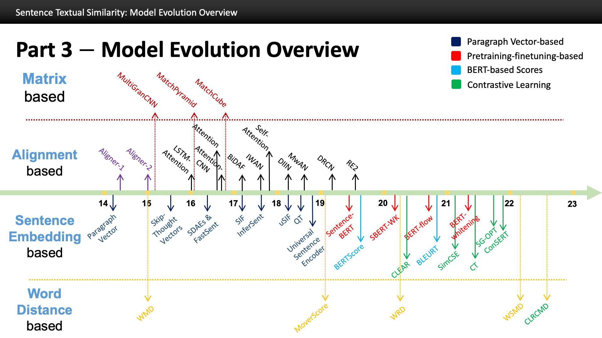

# Awesome-Semantic-Textual-Similarity
Awesome-Semantic-Textual-Similarity: A Curated List of Semantic/Sentence Textual Similarity (STS) in Large Language Models and the NLP Field

 

This repository, called **Awesome-Semantic-Textual-Similarity**, contains a collection of resources and papers 
on **Semantic/Sentence Textual Similarity (STS)** in **Large Language Models** and **NLP**. 

"*If you can't measure it, you can't improve it*. " - British Physicist William Thomson

*Welcome to share your papers, thoughts, and ideas by [submitting an issue](https://github.com/SuperBruceJia/Awesome-Semantic-Textual-Similarity/issues/new)!*

## Contents
- [Model Evolution Overview](#Model-Evolution-Overview)
- [Presentations](#Presentations)
- [Benchmarks](#Benchmarks)
  - [STS](#STS)
  - [SICK-Relatedness](#SICK-Relatedness)
- [Papers](#Papers)
  - [Baselines](#Baselines)
  - [Matrix-based Methods](#Matrix-based-Methods)
  - [Alignment/Attention-based Methods](#Alignment-based-Methods)
  - [Word-Distance-based Methods](#Word-Distance-based-Methods)
  - [Sentence Embedding-based Methods](#Sentence-Embedding-based-Methods)
- [Distance Measurement](#Distance-Measurement)
- [Evaluation Metrics](#Evaluation-Metrics)
  - [Pearson Correlation](#Pearson-Correlation)
  - [Spearman Rank Correlation](#Spearman-Rank-Correlation)

# Model Evolution Overview

# Presentations
**Sentence Textual Similarity: Model Evolution Overview** \
*Shuyue Jia, Dependable Computing Laboratory, Boston University* \
[[Link](https://shuyuej.com/files/Presentation/Sentence_Textual_Similarity-Model_Evolution_Overview.pdf)] \
Oct 2023

# Benchmarks

STS12, STS13, STS14, STS15, STS16, STS Benchmark (STSb), and SICK-Relatedness

# Papers
## Baselines
**GloVe: Global Vectors for Word Representation** \
*Jeffrey Pennington, Richard Socher, Christopher Manning* \
EMNLP 2014, [[Paper](https://aclanthology.org/D14-1162.pdf)] [[GitHub](https://github.com/stanfordnlp/GloVe)] \
25 Oct 2014

**Skip-Thought Vectors** \
*Ryan Kiros, Yukun Zhu, Ruslan Salakhutdinov, Richard S. Zemel, Antonio Torralba, Raquel Urtasun, Sanja Fidler* \
NeurIPS 2015, [[Paper](https://arxiv.org/pdf/1506.06726.pdf)] [[GitHub](https://github.com/nnakul/skip-thought-vectors)] \
22 Jun 2015

**Supervised Learning of Universal Sentence Representations from Natural Language Inference Data** \
*Alexis Conneau, Douwe Kiela, Holger Schwenk, Loïc Barrault, Antoine Bordes* \
EMNLP 2017, [[Paper](https://aclanthology.org/D17-1070.pdf)] [[GitHub](https://github.com/facebookresearch/InferSent)] \
07 Sept 2017

**BERT: Pre-training of Deep Bidirectional Transformers for Language Understanding** \
*Jacob Devlin, Ming-Wei Chang, Kenton Lee, Kristina Toutanova* \
NAACL-HLT 2019, [[Paper](https://aclanthology.org/N19-1423.pdf)] [[GitHub](https://github.com/google-research/bert)] \
24 May 2019

**BERTScore: Evaluating Text Generation with BERT** \
*Tianyi Zhang, Varsha Kishore, Felix Wu, Kilian Q. Weinberger, Yoav Artzi* \
ICLR 2020, [[Paper](https://arxiv.org/pdf/1904.09675.pdf)] [[GitHub](https://github.com/google-research/bleurt)] \
24 Feb 2020

**BLEURT: Learning Robust Metrics for Text Generation** \
*Thibault Sellam, Dipanjan Das, Ankur Parikh* \
ACL 2020, [[Paper](https://aclanthology.org/2020.acl-main.704.pdf)] [[GitHub](https://github.com/Tiiiger/bert_score)] \
05 July 2020

**Dense Passage Retrieval for Open-Domain Question Answering** \
*Vladimir Karpukhin, Barlas Oguz, Sewon Min, Patrick Lewis, Ledell Wu, Sergey Edunov, Danqi Chen, Wen-tau Yih* \
EMNLP 2020, [[Paper](https://aclanthology.org/2020.emnlp-main.550.pdf)] [[GitHub](https://github.com/facebookresearch/DPR)] \
16 Nov 2020

**Universal Sentence Encoder** \
*Daniel Cer, Yinfei Yang, Sheng-yi Kong, Nan Hua, Nicole Limtiaco, Rhomni St. John, Noah Constant, Mario Guajardo-Cespedes, Steve Yuan, Chris Tar, Yun-Hsuan Sung, Brian Strope, Ray Kurzweil* \
arXiv 2018, [[Paper](https://arxiv.org/pdf/1803.11175.pdf)] [[GitHub](https://tfhub.dev/google/universal-sentence-encoder/4)] \
12 Apr 2018

**Sentence-BERT: Sentence Embeddings using Siamese BERT-Networks** \
*Nils Reimers, Iryna Gurevych* \
EMNLP 2019, [[Paper](https://arxiv.org/pdf/1908.10084.pdf)] [[GitHub](https://github.com/UKPLab/sentence-transformers)] \
27 Aug 2019

## Matrix-based Methods
**Pairwise Word Interaction Modeling with Deep Neural Networks for Semantic Similarity Measurement** \
*Hua He, Jimmy Lin* \
NAACL 2016, [[Paper](https://aclanthology.org/N16-1108.pdf)]\
12 June 2016

**Text Matching as Image Recognition** \
*Liang Pang, Yanyan Lan, Jiafeng Guo, Jun Xu, Shengxian Wan, Xueqi Cheng* \
AAAI 2016, [[Paper](https://cdn.aaai.org/ojs/10341/10341-13-13869-1-2-20201228.pdf)] [[GitHub](https://github.com/wyu-du/MatchPyramid-for-semantic-matching)]\
20 Feb 2016

**MultiGranCNN: An Architecture for General Matching of Text Chunks on Multiple Levels of Granularity** \
*Myeongjun Jang, Deuk Sin Kwon, Thomas Lukasiewicz* \
IJCNLP 2015, [[Paper](https://aclanthology.org/P15-1007.pdf)]\
26 July 2015

## Alignment-based Methods
### Attention Mechanism
**Simple and Effective Text Matching with Richer Alignment Features** \
*Runqi Yang, Jianhai Zhang, Xing Gao, Feng Ji, Haiqing Chen* \
ACL 2019, [[Paper](https://aclanthology.org/P19-1465.pdf)] [[GitHub](https://github.com/alibaba-edu/simple-effective-text-matching)] \
01 Aug 2019

**Semantic Sentence Matching with Densely-Connected Recurrent and Co-Attentive Information** \
*Seonhoon Kim, Inho Kang, Nojun Kwak* \
AAAI 2019, [[Paper](https://dl.acm.org/doi/pdf/10.1609/aaai.v33i01.33016586)] [[GitHub (Unofficial)](https://github.com/zhongbin1/DeepMatching)] \
27 January 2019

**Multiway Attention Networks for Modeling Sentence Pairs** \
*Chuanqi Tan, Furu Wei, Wenhui Wang, Weifeng Lv, Ming Zhou* \
IJCAI 2018, [[Paper](https://www.ijcai.org/proceedings/2018/0613.pdf)] [[GitHub](https://github.com/zsweet/zsw_AI_model)] \
13 July 2018

**Natural Language Inference over Interaction Space** \
*Yichen Gong, Heng Luo, Jian Zhang* \
EMNLP 2017, [[Paper](https://arxiv.org/pdf/1709.04348.pdf)] [[GitHub](https://github.com/YichenGong/Densely-Interactive-Inference-Network)] \
13 Sep 2017

**Inter-Weighted Alignment Network for Sentence Pair Modeling** \
*Gehui Shen, Yunlun Yang, Zhi-Hong Deng* \
EMNLP 2017, [[Paper](https://aclanthology.org/D17-1122.pdf)] \
07 Sept 2017

**Bidirectional Attention Flow for Machine Comprehension** \
*Minjoon Seo, Aniruddha Kembhavi, Ali Farhadi, Hannaneh Hajishirzi* \
ICLR 2017, [[Paper](https://arxiv.org/pdf/1611.01603.pdf)] [[Webpage](https://allenai.github.io/bi-att-flow/)] [[GitHub](https://github.com/allenai/bi-att-flow)]\
24 Apr 2017

**A Structured Self-attentive Sentence Embedding** \
*Zhouhan Lin, Minwei Feng, Cicero Nogueira dos Santos, Mo Yu, Bing Xiang, Bowen Zhou, Yoshua Bengio* \
EMNLP 2017, [[Paper](https://arxiv.org/pdf/1703.03130.pdf)] [[GitHub](https://github.com/ExplorerFreda/Structured-Self-Attentive-Sentence-Embedding)] \
09 Mar 2017

**Sentence Similarity Learning by Lexical Decomposition and Composition** \
*Zhiguo Wang, Haitao Mi, Abraham Ittycheriah* \
COLING 2016, [[Paper](https://aclanthology.org/C16-1127.pdf)] [[GitHub](https://github.com/quaizarv/ldc)]\
11 Dec 2016

**A Decomposable Attention Model for Natural Language Inference** \
*Ankur Parikh, Oscar Täckström, Dipanjan Das, Jakob Uszkoreit* \
EMNLP 2016, [[Paper](https://aclanthology.org/D16-1244.pdf)] [[GitHub](https://github.com/harvardnlp/decomp-attn)]\
01 Nov 2016

**Reasoning about Entailment with Neural Attention** \
*Tim Rocktäschel, Edward Grefenstette, Karl Moritz Hermann, Tomáš Kočiský, Phil Blunsom* \
ICLR 2016, [[Paper](https://arxiv.org/pdf/1509.06664.pdf)] [[GitHub](https://github.com/thundergolfer/reasoning-about-entailment-tensorflow)]\
1 Mar 2016

### Traditional Methods
**DLS@CU: Sentence Similarity from Word Alignment and Semantic Vector Composition** \
*Md Arafat Sultan, Steven Bethard, Tamara Sumner* \
SemEval 2015, [[Paper](https://aclanthology.org/S15-2027.pdf)]\
04 June 2015

**Back to Basics for Monolingual Alignment: Exploiting Word Similarity and Contextual Evidence** \
*Md Arafat Sultan, Steven Bethard, Tamara Sumner* \
TACL 2014, [[Paper](https://aclanthology.org/Q14-1018.pdf)]\
01 May 2014

## Word Distance-based Methods
**Improving Word Mover’s Distance by Leveraging Self-attention Matrix** \
*Hiroaki Yamagiwa, Sho Yokoi, Hidetoshi Shimodaira* \
EMNLP 2023 Findings, [[Paper](https://arxiv.org/pdf/2211.06229.pdf)] [[GitHub](https://github.com/ymgw55/WSMD)] \
02 Nov 2023

**Toward Interpretable Semantic Textual Similarity via Optimal Transport-based Contrastive Sentence Learning** \
*Seonghyeon Lee, Dongha Lee, Seongbo Jang, Hwanjo Yu* \
ACL 2022, [[Paper](https://aclanthology.org/2022.acl-long.412.pdf)] [[GitHub](https://github.com/sh0416/clrcmd)] \
22 May 2022

**Word Rotator’s Distance** \
*Sho Yokoi, Ryo Takahashi, Reina Akama, Jun Suzuki, Kentaro Inui* \
EMNLP 2020, [[Paper](https://aclanthology.org/2020.emnlp-main.236v2.pdf)] [[GitHub](https://github.com/eumesy/wrd)] \
16 Nov 2020

**MoverScore: Text Generation Evaluating with Contextualized Embeddings and Earth Mover Distance** \
*Wei Zhao, Maxime Peyrard, Fei Liu, Yang Gao, Christian M. Meyer, Steffen Eger* \
EMNLP 2019, [[Paper](https://aclanthology.org/D19-1053.pdf)] [[GitHub](https://github.com/AIPHES/emnlp19-moverscore)] \
03 Nov 2019

**From Word Embeddings To Document Distances** \
*Matt Kusner, Yu Sun, Nicholas Kolkin, Kilian Weinberger* \
ICML 2015, [[Paper](https://proceedings.mlr.press/v37/kusnerb15.pdf)] [[GitHub](https://github.com/mkusner/wmd)] \
06 July 2015

## Sentence Embedding-based Methods
### Paragraph Vector-based Methods
**Unsupervised Random Walk Sentence Embeddings: A Strong but Simple Baseline** \
*Kawin Ethayarajh* \
RepL4NLP 2018, [[Paper](https://aclanthology.org/W18-3012.pdf)] [[GitHub](https://github.com/kawine/usif)] \
20 July 2018

**An Efficient Framework for Learning Sentence Representations** \
*Lajanugen Logeswaran, Honglak Lee* \
ICLR 2018, [[Paper](https://arxiv.org/pdf/1803.02893.pdf)] [[GitHub](https://github.com/lajanugen/S2V)] \
30 Apr 2018

**Universal Sentence Encoder** \
*Daniel Cer, Yinfei Yang, Sheng-yi Kong, Nan Hua, Nicole Limtiaco, Rhomni St. John, Noah Constant, Mario Guajardo-Cespedes, Steve Yuan, Chris Tar, Yun-Hsuan Sung, Brian Strope, Ray Kurzweil* \
arXiv 2018, [[Paper](https://arxiv.org/pdf/1803.11175.pdf)] [[GitHub](https://tfhub.dev/google/universal-sentence-encoder/4)] \
12 Apr 2018

**Supervised Learning of Universal Sentence Representations from Natural Language Inference Data** \
*Alexis Conneau, Douwe Kiela, Holger Schwenk, Loïc Barrault, Antoine Bordes* \
EMNLP 2017, [[Paper](https://aclanthology.org/D17-1070.pdf)] [[GitHub](https://github.com/facebookresearch/InferSent)] \
07 Sept 2017

**A Simple but Tough-to-Beat Baseline for Sentence Embeddings** \
*Sanjeev Arora, Yingyu Liang, Tengyu Ma* \
ICLR 2017, [[Paper](https://openreview.net/pdf?id=SyK00v5xx)] [[GitHub](https://github.com/PrincetonML/SIF)] \
06 Feb 2017

**Learning Distributed Representations of Sentences from Unlabelled Data** \
*Felix Hill, Kyunghyun Cho, Anna Korhonen* \
NAACL 2016, [[Paper](https://aclanthology.org/N16-1162.pdf)] [[GitHub (Unofficial)](https://github.com/Hediby/fastsent_theano)] \
12 Jun 2016

**Skip-Thought Vectors** \
*Ryan Kiros, Yukun Zhu, Ruslan Salakhutdinov, Richard S. Zemel, Antonio Torralba, Raquel Urtasun, Sanja Fidler* \
NeurIPS 2015, [[Paper](https://arxiv.org/pdf/1506.06726.pdf)] [[GitHub](https://github.com/nnakul/skip-thought-vectors)] \
22 Jun 2015

**Distributed Representations of Sentences and Documents** \
*Quoc V. Le, Tomas Mikolov* \
ICML 2014, [[Paper](https://arxiv.org/pdf/1405.4053.pdf)] \
21 June 2014

### Pretraining-finetuning Paradigm
**Whitening Sentence Representations for Better Semantics and Faster Retrieval** \
*Jianlin Su, Jiarun Cao, Weijie Liu, Yangyiwen Ou* \
arXiv 2021, [[Paper](https://arxiv.org/pdf/2103.15316.pdf)] [[GitHub (TensorFlow)](https://github.com/bojone/BERT-whitening)] [[GitHub (PyTorch)](https://github.com/autoliuweijie/BERT-whitening-pytorch)]\
29 Mar 2021

**On the Sentence Embeddings from Pre-trained Language Models** \
*Bohan Li, Hao Zhou, Junxian He, Mingxuan Wang, Yiming Yang, Lei Li* \
EMNLP 2020, [[Paper](https://arxiv.org/pdf/2011.05864.pdf)] [[GitHub](https://github.com/bohanli/BERT-flow)] \
02 Nov 2020

**SBERT-WK: A Sentence Embedding Method by Dissecting BERT-based Word Models** \
*Bin Wang, C.-C. Jay Kuo* \
IEEE/ACM T-ASLP, [[Paper](https://arxiv.org/pdf/1908.10084.pdf)] [[GitHub](https://github.com/BinWang28/SBERT-WK-Sentence-Embedding)] \
29 July 2020

**Sentence-BERT: Sentence Embeddings using Siamese BERT-Networks** \
*Nils Reimers, Iryna Gurevych* \
EMNLP 2019, [[Paper](https://arxiv.org/pdf/1908.10084.pdf)] [[GitHub](https://github.com/UKPLab/sentence-transformers)] \
27 Aug 2019

### BERT-based Scores
**BLEURT: Learning Robust Metrics for Text Generation** \
*Thibault Sellam, Dipanjan Das, Ankur Parikh* \
ACL 2020, [[Paper](https://aclanthology.org/2020.acl-main.704.pdf)] [[GitHub](https://github.com/Tiiiger/bert_score)] \
05 July 2020

**BERTScore: Evaluating Text Generation with BERT** \
*Tianyi Zhang, Varsha Kishore, Felix Wu, Kilian Q. Weinberger, Yoav Artzi* \
ICLR 2020, [[Paper](https://arxiv.org/pdf/1904.09675.pdf)] [[GitHub](https://github.com/google-research/bleurt)] \
24 Feb 2020

### Contrastive Learning Framework
**Toward Interpretable Semantic Textual Similarity via Optimal Transport-based Contrastive Sentence Learning** \
*Seonghyeon Lee, Dongha Lee, Seongbo Jang, Hwanjo Yu* \
ACL 2022, [[Paper](https://aclanthology.org/2022.acl-long.412.pdf)] [[GitHub](https://github.com/sh0416/clrcmd)] \
22 May 2022

**SimCSE: Simple Contrastive Learning of Sentence Embeddings** \
*Tianyu Gao, Xingcheng Yao, Danqi Chen* \
EMNLP 2021, [[Paper](https://aclanthology.org/2021.emnlp-main.552.pdf)] [[GitHub](https://github.com/princeton-nlp/simcse)] \
03 Jun 2021

**Self-Guided Contrastive Learning for BERT Sentence Representations** \
*Taeuk Kim, Kang Min Yoo, Sang-goo Lee* \
ACL 2021, [[Paper](https://arxiv.org/pdf/2106.07345.pdf)] [[GitHub](https://github.com/galsang/SG-BERT)] \
03 Jun 2021

**ConSERT: A Contrastive Framework for Self-Supervised Sentence Representation Transfer** \
*Yuanmeng Yan, Rumei Li, Sirui Wang, Fuzheng Zhang, Wei Wu, Weiran Xu* \
ACL 2021, [[Paper](https://arxiv.org/pdf/2105.11741.pdf)] [[GitHub](https://github.com/yym6472/ConSERT)] \
25 May 2021

**Semantic Re-tuning with Contrastive Tension** \
*Fredrik Carlsson, Amaru Cuba Gyllensten, Evangelia Gogoulou, Erik Ylipää Hellqvist, Magnus Sahlgren* \
ICLR 2021, [[Paper](https://openreview.net/pdf?id=Ov_sMNau-PF)] [[GitHub](https://github.com/FreddeFrallan/Contrastive-Tension)] \
03 May 2021

**CLEAR: Contrastive Learning for Sentence Representation** \
*Zhuofeng Wu, Sinong Wang, Jiatao Gu, Madian Khabsa, Fei Sun, Hao Ma* \
arXiv 2020, [[Paper](https://arxiv.org/pdf/2012.15466.pdf)] \
31 Dec 2020

# Distance Measurement
**Evolution of Semantic Similarity - A Survey** \
*Dhivya Chandrasekaran, Vijay Mago* \
ACM Computing Survey 2021, [[Paper](https://dl.acm.org/doi/pdf/10.1145/3440755)] \
18 February 2021

**Distributional Measures of Semantic Distance: A Survey** \
*Saif M. Mohammad, Graeme Hirst* \
arXiv 2012, [[Paper](https://arxiv.org/pdf/1203.1858.pdf)] \
8 Mar 2012

# Evaluation Metrics
## Pearson Correlation
Pearson Linear Correlation Coefficient − measure the prediction accuracy

$$
r=\frac{\sum_{i=1}^n\left(s_i-\bar{s}\right)\left(q_i-\bar{q}\right)}{\sqrt{\sum_{i=1}^n\left(s_i-\bar{s}\right)^2} \sqrt{\sum_{i=1}^n\left(q_i-\bar{q}\right)^2}},
$$

where $s_i$ and $q_i$ are the gold label and the model’s prediction of the $i$-th sentence. $\bar{s}$ and $\bar{q}$ are the mean values of $\textbf{s}$ and $\textbf{q}$. $n$ is the number of sentences.

## Spearman Rank Correlation
(Spearman’s Rank-order Correlation Coefficient) − measure the prediction monotonicity

$$ 
\rho=1-\frac{6 \sum_{i=1}^n d_i^2 }{n\left(n^2-1\right)},
$$

where $d_i$ is the difference between the $i$-th sentence’s rank in the model’s predictions and gold labels. 
